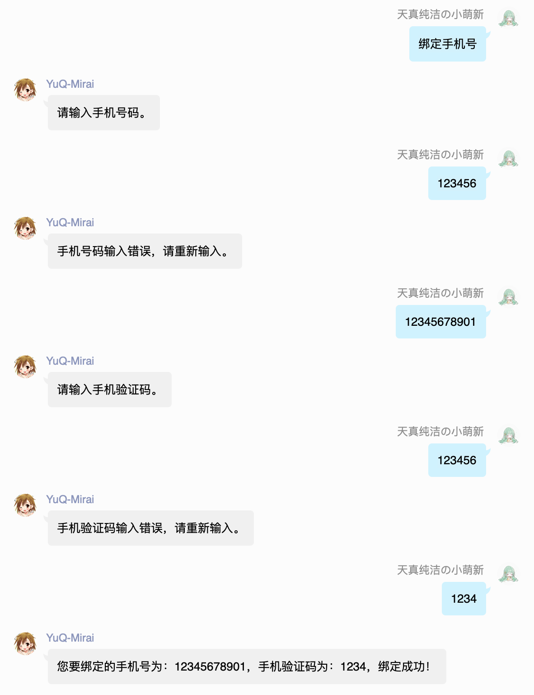

YuQ-Mirai 是一个以 [Mirai-Rain](https://github.com/YuQWorks/Mirai-Rain) 为基础，并实现了 [YuQ API](https://github.com/YuQWorks/YuQ) 的 QQ 机器人快速开发框架。

 - 路由映射
 - 依赖注入
 - 定时任务
 - ORM支持
 - 上下文消息
 
YuQ-Mirai 使用 Kotlin 开发，并且完美支持 Java 与 Kotlin。 

[](https://search.maven.org/#search|ga|1|com.IceCreamQAQ.YuQ.YuQ-Mirai)

 
在 YuQ 我们仅需很简单的代码，就可以完成很复杂的功能。  
比如，我们要针对一个指令"菜单"，进行一个标准的菜单消息回复。
```Java
@GroupController
public class GroupMenu{ 
    @Action("菜单")
    public String menu(){
        return "这是具体的菜单内容。";
    } 
}
```
YuQ 会在指令式机器人的开发中，提供非常好的帮助，让开发者能有更好的开发体验。  
在 Controller 中，我们的 Action 方法，返回的内容，会直接构建成消息，并发送当当前消息源。  
通过路由映射，我们可以很方便的编写指令，只需要将 Class 声明为一个 Controller，并且编写 Action 方法。  
其余的，YuQ 会帮您完成。  

比如我们想禁言一个人，禁言的指令为"ban @xxx或QQ号码 time"
我们只需要编写：
```Java
@GroupController
public class GroupMenu{
     @Action("ban {ban} {time}")
     public String ban(Member ban, int time){
         ban.ban(time);
         return "好的！";
     }
}
```
这样，我们就可以很轻易的完成 ban 这个指令了。

对于需要连续对话的指令式机器人，基于 YuQ 也可以轻松满足。  


